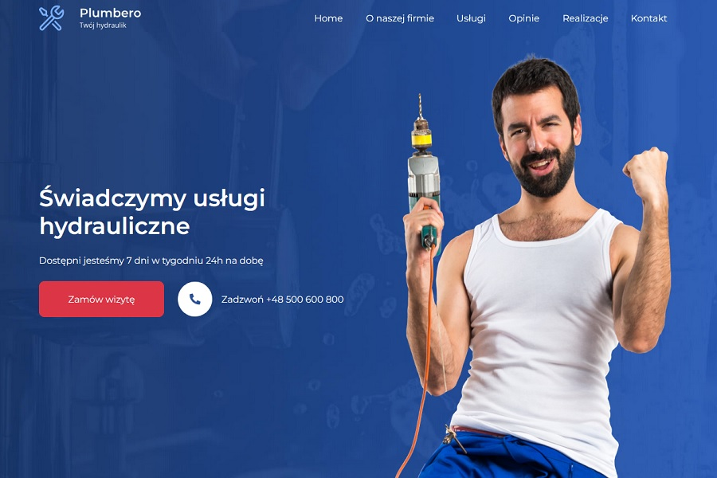

## Plumbero
### Template website for plumber
###### Year: 2022

HTML5 / SCSS / BOOTSTRAP

**Plumbero -** Template for Plumber :plunger: . First photo shows that the plumber is happy, probably because of the website he has, who knows? :upside_down_face: The photos show that the employee is ambitious and works with commitment. Professional plumber needs a professional website :wrench:. Contact form, portfolio, description of work performed and customer reviews, of course only positive ones :slightly_smiling_face: . All this on a One page website. A clean, clear and neat template, like the hands of our plumber. :raising_hand_man:

:poland:
**Plumbero -** Szablon dla hydraulika :plunger: . Na pierwszym zdjęciu widać, że hydraulik jest zadowolony, pewnie to za sprawą posiadanej strony internetowej, kto wie? :upside_down_face: Zdjęcia pokazują, że pracownik jest ambitny i pracuje z zaangażowaniem. Profesjonalny hydraulik, potrzebuje profesjonalnej strony internetowej :wrench: . Formularz kontaktowy, portfolio, opis wykonywanych prac oraz opinie klientów, oczywiście tylko te pozytywne :slightly_smiling_face: . Wszytko to na stronie typu One page. Czysty, przejrzysty i schludny szablon, jak ręce naszego hydraulika. :raising_hand_man:

### :tada: [Live](https://damiankoduje.pl/templates/plumbero)

### Credits:
- [Bootstrap](https://getbootstrap.com)
- [Freepik](https://freepik.com)
- [Montserrat](https://fonts.google.com/specimen/Montserrat)
- [AOS](https://michalsnik.github.io/aos)
- [GLightbox](https://biati-digital.github.io/glightbox)
- [Swiper](https://swiperjs.com)
- [moveTo](https://hsnaydd.github.io/moveTo)

### Design by [Artbart](https://www.behance.net/artbart)
### :hand: Template created by [Damiankoduje.pl](https://damiankoduje.pl)